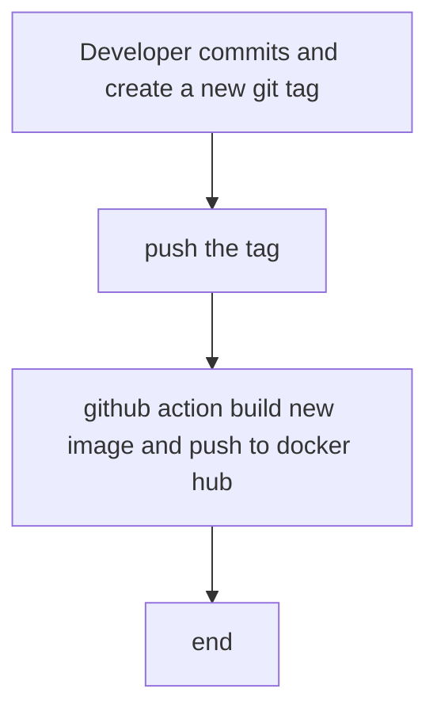

# Version 1.4.0

To build the app:
```bash
docker build -t andyyuanchun/2025cloud:latest .
```

To run the image:
```bash
docker run -it andyyuanchun/2025cloud:latest
```



```mermaid
flowchart TD
    A[Developer commits and create a new git tag] --> B[push the tag] --> C[github action build new image and push to docker hub] --> D[end]
```
