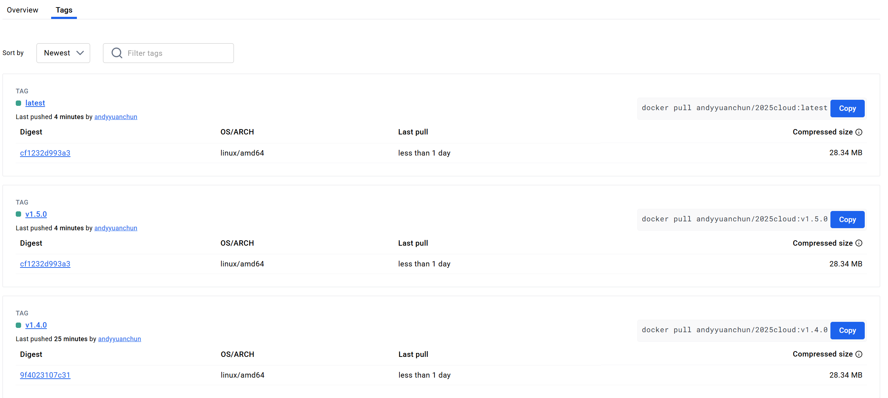
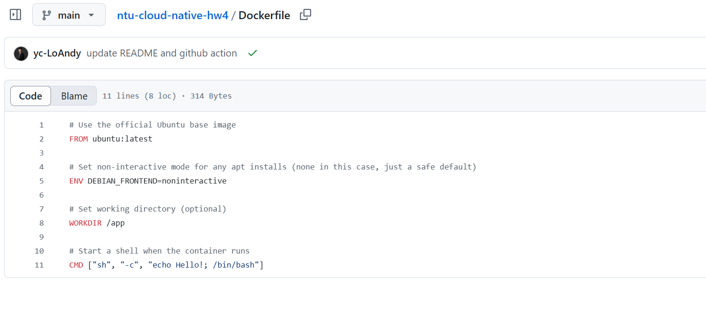
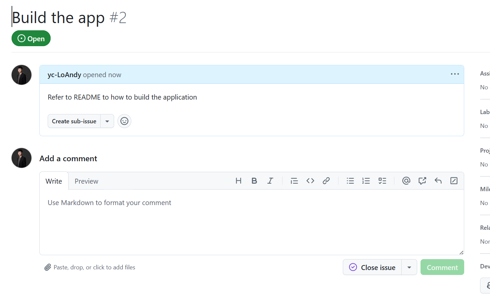
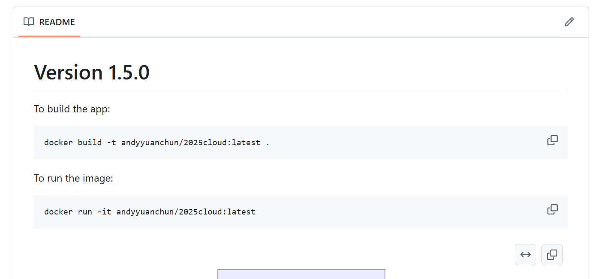
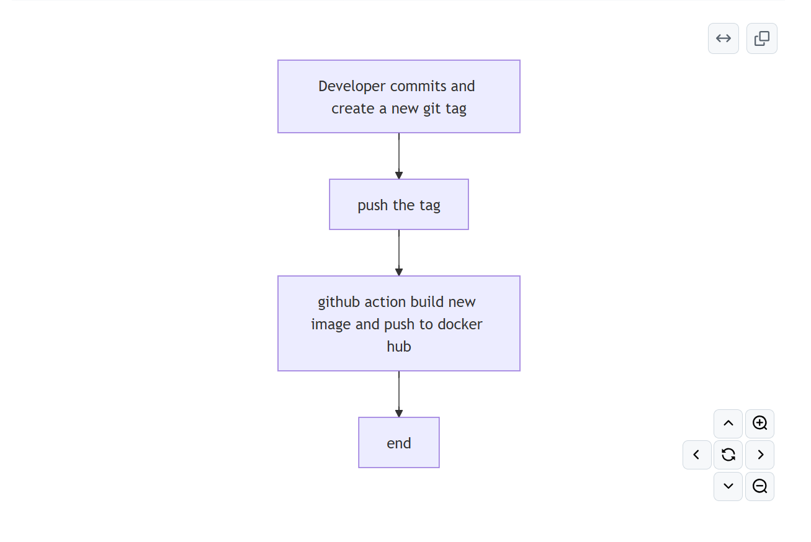

# NTU Cloud Native HW4
- Name: 羅元駿
- Student ID: r13922162

Github Repo is accessible [here](https://github.com/yc-LoAndy/ntu-clound-native-hw4).
Docker Hub Repo is accessible [here](https://hub.docker.com/r/andyyuanchun/2025cloud/tags)

## Docker Hub
1. Please refer to the above link to my docker hub.
2. At least 2 container image:
   

## Git Repo README & Dockerfile
1. The docker file in my repo
   
2. The issue
   
3. README.md
   

## Github action
1. The git hub action [link](https://github.com/yc-LoAndy/ntu-cloud-native-hw4/actions)
2. One of the action pushing the image to docker hub: [link](https://github.com/yc-LoAndy/ntu-cloud-native-hw4/actions/runs/14806991849/job/41576770585)
3. The failing PR: [here](https://github.com/yc-LoAndy/ntu-cloud-native-hw4/pull/1), and the failing check: [here]()

## Documentation

